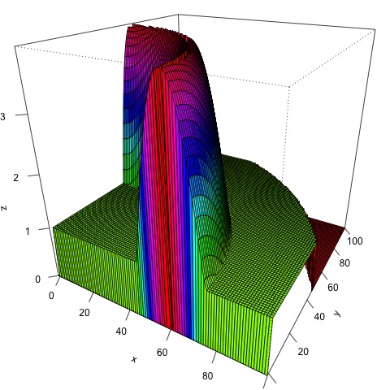

# Ad hoc Network (STAT 302 Final Project)

---

# What is an Ad Hoc Wireless Network?

- Nowadays, we rely heavily on our cell phones to receive messages and communicate with others around the world.

- Traditionally, our cell phones need to communicate with a nearby base station in order to send and received calls.

  - Calls	are relayed from base stations to base stations as the cell phone moves.
  
  - This may influence the quality of our calls when our cell phones are far away from the nearest base station.

- The **ad hoc wireless network** instead relays messages via other devices in the network.

  - There are no centralized nodes or fixed structures.
  
  - Devices can dynamically enter and exit the network.
  
  - A Message hops from one device to the next until it reaches its destination.
  
---

# An Example of the Ad Hoc Network

- An ad hoc network with 6 disconnected clusters/components.

---

# Connected Ad Hoc Network

- We are interested in those connected networks.
  
<!-- - There is at least one path between each pair of devices in the network.
-->
  
- Given a particular configuration of nodes, we want to know the smallest radius $R_c$ that makes a connected network.

- We also want to study the distribution of $R_c$ for different configurations of the nodes.

---

# Simulation Study for Ad Hoc Network

1. We will randomly generate nodes for an ad hoc network according to some pre-specified node density (generally determined by the geographical information).

---

# Simulation Study for Ad Hoc Network

1. We will randomly generate $n$ nodes for an ad hoc network according to some pre-specified node density (generally determined by the geographical information). Specifically, we will use the acceptance-rejection algorithm.

- Generate points uniformly in a three-dimensional rectangle.

- If the points fall in the three-dimensional region beneath the density, then we keep them.

- Use the $(x,y)$ coordinates of these accepted points as our sample.

---

# Simulation Study for Ad Hoc Network

1. We will randomly generate $n$ nodes for an ad hoc network according to some pre-specified node density (generally determined by the geographical information).

2. Find the smallest $R_c$ such that the nodes are connected through paths in the network.

3. Repeat several times for each $n$.

4. Study the distribution of $R_c$.

[Project Description](https://raw.githubusercontent.com/zhangyk8/zhangyk8.github.io/master/_teaching/file_stat302/Lectures/Final_Project.pdf)
